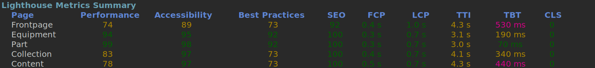

# Web Audit Tool

## Tool Goals
- Collect website insights from different sources.
- Surface the most meaningful insights.

## Who this is for
- SEO, Development and QA teams who need a lightweight CLI/TUI for running website checks.

## Why
Website audits are often manual, inconsistent, or hard to interpret. This tool automates Lighthouse runs and highlights the highest-impact insights.

## How it works
- Runs Lighthouse programmatically for URL batches.
- Persists raw JSON reports
- Surfaces summarized insights.

## Widget Samples

# Metrics Summary

Example: Lighthouse Metrics

# Discrepancy Table

Shows missing elements across a group.

Example: 3rd-party running scripts across Pages.

---

This is a work in progress. While it already works, I'm not shipping installation instructions yet.
