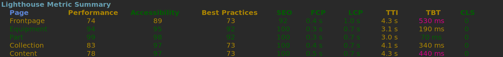
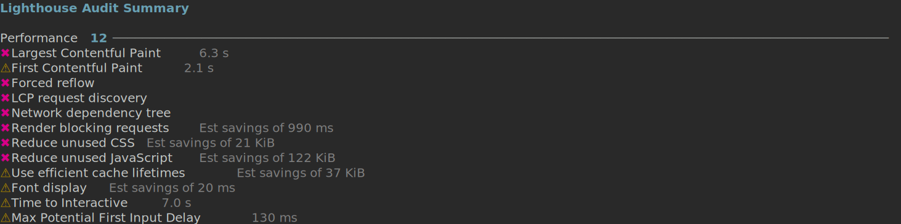

# Web Audit Tool

## Tool Goals
- Collect website insights from different sources.
- Surface the most meaningful insights.

## Who this is for
- SEO, Development and QA teams who need a lightweight CLI/TUI for running website checks.

## Why
Website audits are often manual, inconsistent, or hard to interpret. This tool automates Lighthouse runs and highlights the highest-impact insights.

## How it works
- Runs Lighthouse programmatically for URL batches.
- Persists raw JSON reports
- Surfaces summarized insights.

# Widget Samples

## Metric Summary

## Audit Summary

## Discrepancy Table

Shows missing elements across a group.

Example: 3rd-party running scripts across Pages.

---
## Comming Features

[Product Value Open Features](https://github.com/oct-cr/web-audit-tool/issues?q=is%3Aissue%20state%3Aopen%20label%3A%22product%20value%22)
